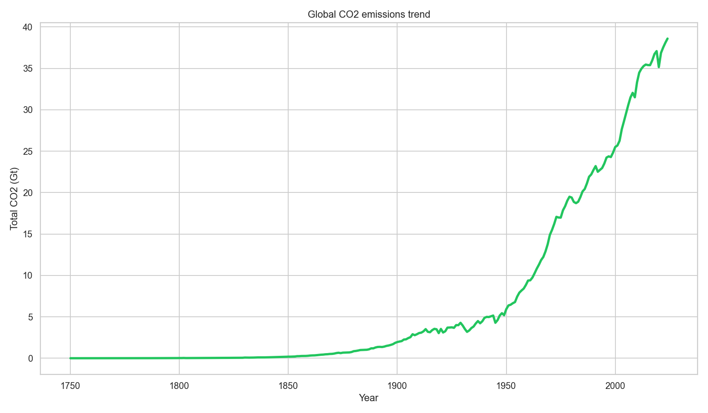
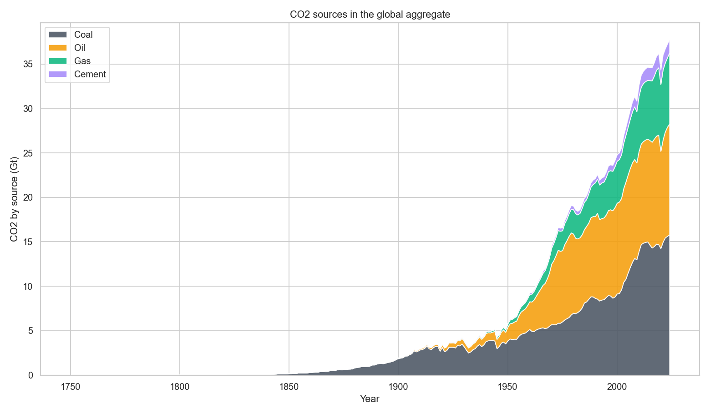
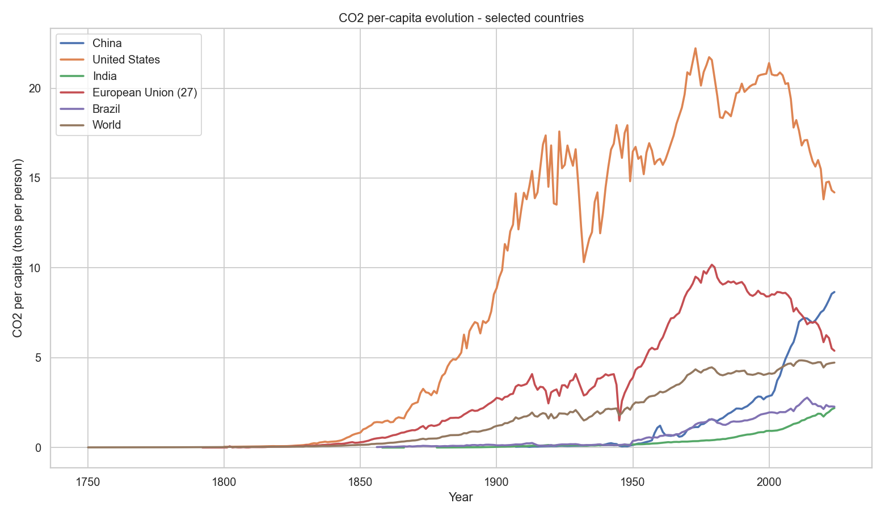
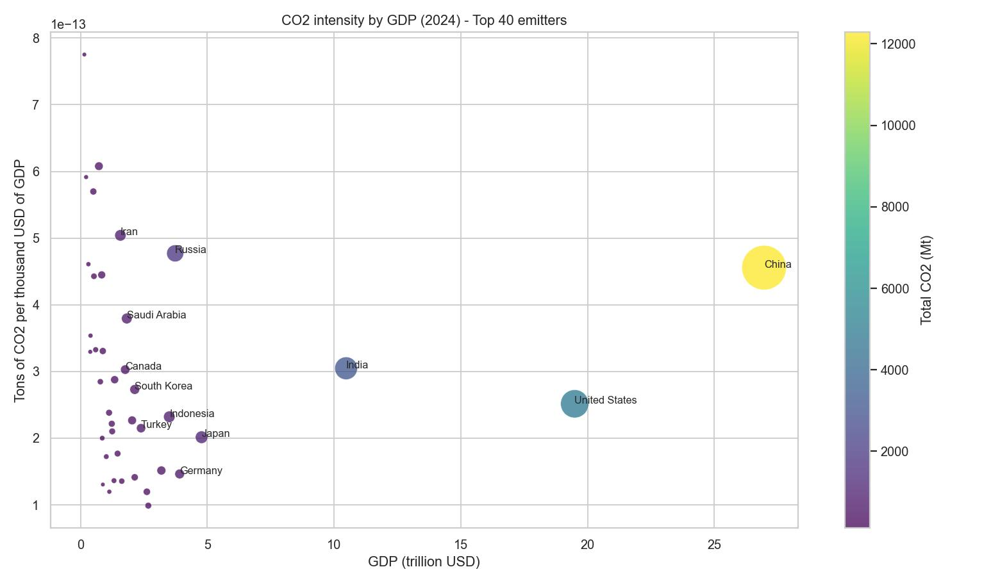
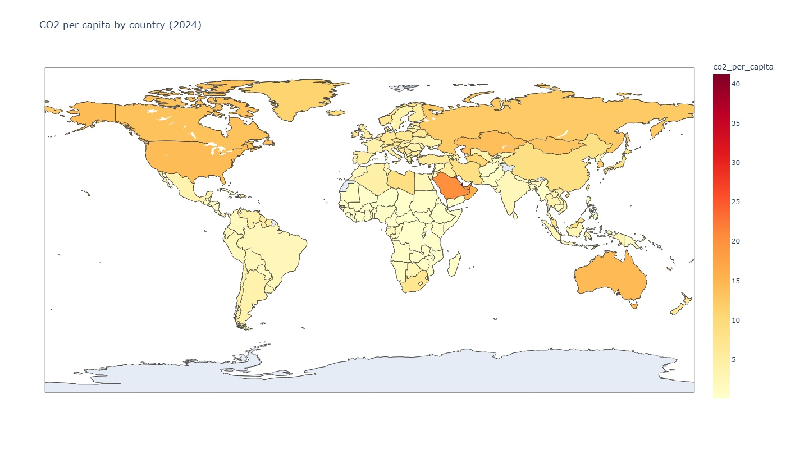

# Emissões Globais de CO₂  
## Análise Histórica, Estrutural e Econômica

Estudo analítico das emissões globais de CO₂ com base nos dados do *Our World in Data*, explorando:

- Evolução histórica das emissões  
- Estrutura por fonte energética  
- Distribuição desigual entre países  
- Relação entre volume, população e eficiência econômica  

O objetivo é compreender como **escala econômica, estrutura energética e intensidade produtiva** moldam o sistema climático global.

---

# 1️⃣ Crescimento Histórico das Emissões

As emissões globais cresceram de **9 Mt em 1750** para **38.599 Mt em 2024**.

Esse crescimento não pode ser explicado apenas pelo aumento populacional.  
O fator estrutural dominante foi a **intensificação do consumo energético baseada em combustíveis fósseis**, impulsionada pela industrialização.

### Interpretação estrutural

- Século XIX → consolidação do carvão  
- Século XX → expansão via petróleo e gás  
- Século XXI → crescimento contínuo com dependência fóssil persistente  

A transição energética global permanece incompleta.

---

# 2️⃣ Estrutura das Fontes de Emissão

A composição das emissões evidencia forte dependência estrutural de combustíveis fósseis:

- Carvão → base da industrialização inicial  
- Petróleo → transporte e expansão econômica do século XX  
- Gás natural → complemento relevante na matriz moderna  

Apesar do crescimento das energias renováveis, a matriz energética global ainda é majoritariamente fóssil.

---

# 3️⃣ Emissões Absolutas — Impacto Sistêmico

O volume absoluto define o impacto climático direto no estoque global de carbono.

Grandes economias concentram parcela significativa das emissões totais, tornando-se centrais em qualquer estratégia de estabilização climática.

**Escala importa.**

---

# 4️⃣ Emissões Per Capita — Desigualdade Climática

A métrica per capita revela diferenças estruturais na responsabilidade individual entre países.

### Maiores emissores per capita (2024)

- Qatar — 41,27 t/pessoa  
- Kuwait — 26,25 t/pessoa  
- Brunei — 26,05 t/pessoa  

Economias altamente dependentes da produção de energia fóssil apresentam intensidade individual elevada, mesmo com populações pequenas.

### Interpretação

- País pequeno → alta intensidade individual, impacto global limitado  
- País grande → intensidade moderada, mas grande impacto total  

Per capita mede desigualdade.  
Volume mede impacto sistêmico.

---

# 5️⃣ Eficiência Econômica (CO₂ por PIB)

A intensidade econômica mede quantas toneladas de CO₂ são emitidas para gerar US$ 1.000 de PIB.

### Baixa intensidade

- Reino Unido  
- Alemanha  
- Japão  

Economias que produzem maior valor por unidade de carbono emitido.

### Alta intensidade

- África do Sul  
- Irã  
- China  

Maior dependência estrutural de combustíveis fósseis e presença relevante de indústria pesada.

Intensidade econômica mede **eficiência produtiva**, não escala total.

---

# 6️⃣ Integração dos Indicadores

A análise conjunta revela três dimensões complementares:

| Dimensão | O que mede | Implicação estratégica |
|----------|------------|------------------------|
| Volume total | Impacto climático global | Prioridade em redução absoluta |
| Per capita | Responsabilidade média individual | Debate distributivo e equidade |
| Intensidade por PIB | Eficiência produtiva | Modernização e transição energética |

Separadamente, cada indicador é incompleto.  
Em conjunto, formam um diagnóstico estrutural robusto.

---

#  Insight Estratégico Final

A dinâmica climática global resulta da interação entre:

- Escala econômica  
- Estrutura energética  
- Eficiência produtiva  

Reduções efetivas exigem abordagens diferenciadas:

- Grandes emissores → redução absoluta de volume  
- Economias intensivas → transição estrutural da matriz energética  
- Países de alta emissão per capita → revisão de padrões de consumo  

O sistema climático global não é explicado por rankings isolados.  
Ele é determinado por **estrutura, escala e intensidade combinadas**.
